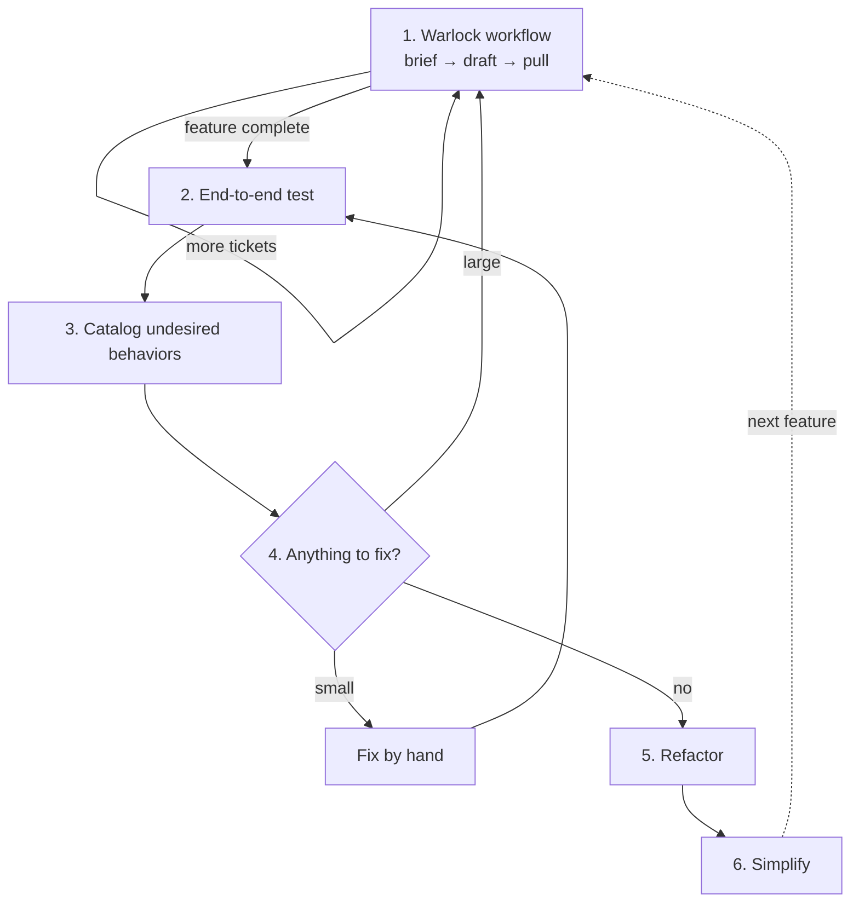

<p align="center">
  
</p>

<h1 align="center">warlock</h1>

<p align="center"><strong>See your codebase the way your AI does. A TUI where documentation is the interface.</strong></p>

<p align="center">
  <a href="https://github.com/Genetic-Pottery/warlock/blob/main/LICENSE"></a>
  <a href="https://github.com/Genetic-Pottery/warlock/releases/latest"></a>
</p>

---

> **warlock** *(n.)* one who draws power from a pact with an entity greater than
> themselves. The patron is the model. The pact is the boundary. Invocations are
> agent runs.

## What this is

AI tool which medium to large sized companies could use as a team effectively.
I imagined what would an IDE look like 20-30 years from now and came up with this.
AI is the star of the show and looking at code is not the primary concern.

## What you get

Text User Interface (TUI)
- pacts: A directory under the control of warlock, it scans the directory and creates an artifact to help itself reason about the code.
- scope: Pair a directory with a Linear team, this is what is checked when an AI does work to ensure changes are scoped.
- sigil: A local per-user array of string which allow you and your AI to access a specific repos scope.

Workflow
- brief: The ability to talk to the AI and discuss large feature of work you wish to create, you will have you assumptions pushed up against and at the end of the conversation you can write a document to the repo.
- draft: The ability to turn a brief into multiple tickets with dependency graph relationships.
- pull: Warlock will pull the next available ticket, cut it into sub-tickets locally and work within your allowed scope. There is local state and ability to recover from going over limits or crashes.

## Walk through

### File tree navigation

> move up / down, collapse directories, show / hide only pacted directories, show / hide files

### Brief creation

> type /brief and begin a conversation defining a large scope of work where the AI challenges you for more details of the scope

### Writing a brief

> type /write once your shared understanding with the AI has been reached and a document will be written which eventually will be turned into tickets

### Pushing a brief

> type /push [SCOPE] [PATH_TO_BRIEF] to push a brief to Linear as a Project. Nothing is kept locally, so you can delete the brief once it's pushed


> the Project will land in Linear with a set format which future workflows can digest and turn into Issues

### Drafting into issues

> type /draft [SCOPE] to list the scope's planned Projects, then /draft [SCOPE] [SLUG] to draft one into Linear Issues. If a model requires more information to make a well scoped Issue it will ask you to provide clarification


> Issues appear in backlog with a customizable label, Project association, and assigned to self

### Pulling issues

> work is pulled for specific scopes; an Issues is pulled which has no blocking tickets, is assigned to you, and has the custom label


> when work is being worked on it is In Progress and once it is completed it is moved to a customizable final state, in this case In Review


> once work is complete the Linear ticket and dialog will display the Github URL where the PR is awaiting a human review

## Suggested workflow
Build a feature with the warlock workflow, then test it end to end before you clean it up.
Fix small problems by hand, and send large ones back through the workflow as new tickets.
For refactoring I recommend Matt Pocock's [skill](https://github.com/mattpocock/skills) improve-codebase-architecture.
For simplifying code I recommend Claude's inbuilt /simplify and direct it to pass over all code not just recent changes.

This is still in line with what people really did before AI: every warlock workflow cycle is a step toward a desired end point, and when you get to a good resting place you evaluate:
- Am I going the right direction, should I change course?
- Does this feel good to use, is it hacky?
- Are there bugs?

This isn't a magically finished product you are approaching an abstract state and adjust your mental model as you go.



## Why this exists

Editors and AI-enabled IDEs add AI features as an after thought and gear everything toward prompt engineering.
The AI features are at best saved conversations and a chat window off to the side.

Meanwhile most people are shipping AI-written code and sanding it down to lookhand-written. 
Stripping the em dashes. Not letting the model commit. 
A whole industry using AI while performing restraint, which means using it poorly. 
No structure, no shared context, no record. The pretending is the waste.

Warlock admits what the game is. 
The interface is your project rendered as the AI understands it.
A tree of directories, coloured by whether that understanding is still true. 
You can still open files and read them. That is no longer the main event.

## What it promises

- **Documentation that is actually current.** The document the AI use to reason about the code
  turn stale as soon as the code refernced in the document changes. Your documents are always up to date.
- **A record that survives you.** Every change lands in the ticket tracker of youre choice.
  Or is commited within the repo. Everything is visible.
- **Process artifacts as a byproduct.** Most teams LARP process: the ticket
  exists, the doc exists, and both are one-sentence husks. Warlock's artifacts
  are real by construction, because the work runs through them rather than
  around them. In order to use the tool you MUST talk to the AI to challenge your assumptions,
  turn that resulting document into tickets visible to the team, and work on tickets and leave a PR for 
  human review.
- **Your subscription, your leverage.** Warlock holds no credentials of its own
  and resells no inference. It drives the `claude` CLI you are already paying
  for, which has to be on your `PATH` and logged in before Warlock can do
  anything with a model.

## What it is not

- **Not autonomous.** Nothing merges because a model felt good about it. Every
  consequential step is a human decision, and the point of the framework is that
  the decision leaves a trace instead of evaporating.
- **Not a project generator.** It will not turn one sentence into a shipped
  feature, and it does not manufacture thought. A lazy one-liner inflated into a
  beautifully formatted page is still a lazy one-liner, now with better
  typography.
- **Not an editor.** You can hand-edit anything, and the next refresh will
  notice and reconcile. But the tool is not optimised for code editing, and
  anyone who wants to is not the customer.

## Install

macOS (Homebrew):

```sh
brew install genetic-pottery/tap/warlock
```

Linux (Ubuntu, Fedora, Arch, and others):

```sh
curl -LsSf https://github.com/Genetic-Pottery/warlock/releases/latest/download/warlock-tui-installer.sh | sh
```

Nix (Linux and Apple silicon macOS):

```sh
nix profile install github:Genetic-Pottery/warlock
```

From source (Rust 1.97.1 or later):

```sh
cargo install --git https://github.com/Genetic-Pottery/warlock warlock-tui
```

## Requirements

- macOS or Linux. Windows is not supported.
- `git`.
- The `claude` CLI, on your `PATH` and logged in.
- A Linear personal API key, for `push`, `draft`, and `pull`. Keys are stored
  once per machine under a name, and each repository binds one of them:

  ```sh
  warlock key add <api-key-name>   # paste the key; it isn't echoed
  warlock key use <api-key-name>   # run inside the repository
  ```
- `gh`, logged in, if you want `pull` to open pull requests. Without it, `pull`
  pushes the branch and leaves the pull request text on the ticket.

## Troubleshooting

**Why are my borders not even?**

Warlock draws its panes with Unicode box-drawing characters.
Use a monospace font with box-drawing coverage — most programming fonts have it.

## Contributing

See [CONTRIBUTING.md](CONTRIBUTING.md).

## License

Apache License 2.0. See [LICENSE](LICENSE) and [NOTICE](NOTICE).
